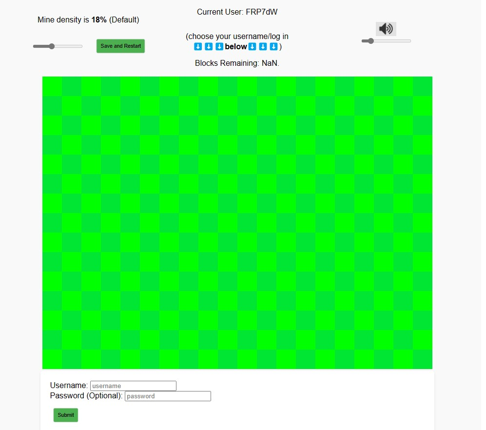
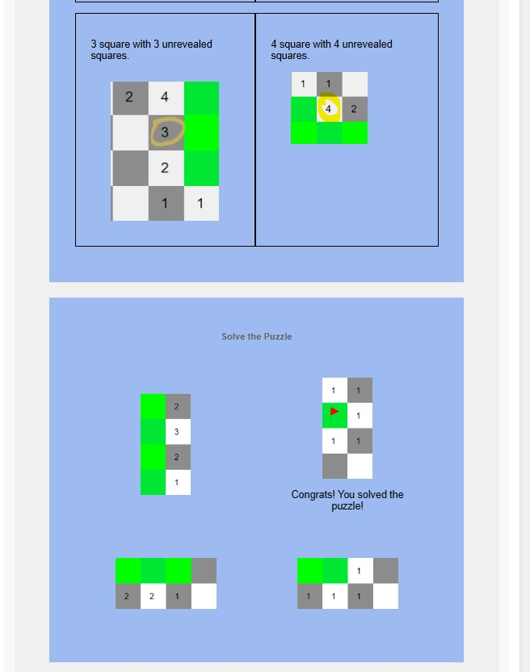
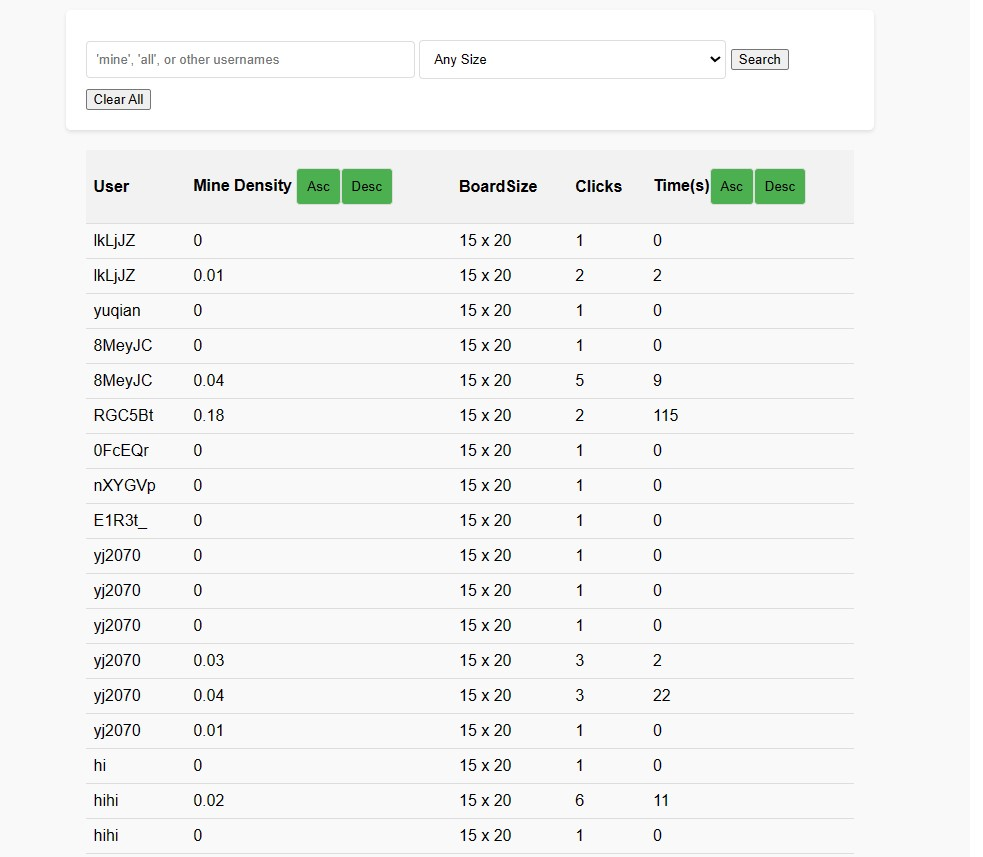

# Minesweeper (with AI and Tutorial)

## Overview

Ever Had fun in your childhood playing Minesweeper? Then this web version is for you! Original Success page, sound effects, and even a help button and leaderboard features. Don't know how to play? No worries, a tutorial page is waiting to serve you! Everything you need for Minesweeper is Here!


## Data Model


The application will store Users and Game statistics

* users can have multiple games played (via references)
* game statistics

An Example User:

```javascript
{
  username: "shannonshopper",
  hash:  "an optional password hash",
  IdList: [1, 3, 5, 6]
}
```

An Example Game Statitics Item:

```javascript
{
  GameId: 1,
  Difficulty: "hard",
  BoardSize: {height:15, width:30}
  clicks: 79,
  timeCompleted: 06/02/2023// timestamp
}
```


## [Link to Commented First Draft Schema](db.mjs) 


## Wireframes

/minesweeper- page for the main game



/minesweeper/tutorial - page for interactive tutorial



/minesweeper/leaderboard - page for login/register and leaderboard table



## Site map


## User Stories or Use Cases

1. as non-registered user, I can play the game normally
2. as a user, I can log in to the site
3. as a user, I can view my previous game statistics
4. as a user, I can view and play with the interactive tutorial
5. as a user, I can view the leaderboard containing the top n players

## Research Topics


* (2 points) Vercel Deployment
    * used Vercel to create a serverless connection
* (5 points) P5.js 
    * used p5.js to create nice 2d graphics and interactions
    * used instance mode in tutorial to create multiple canvas
* (1 point) DOM manipulation
    * used DOM elements before taught
* (1 point) p5.sound.js
    * used p5.sound.js to add custom audio when different game action triggers

9 points total out of 10 required points 


## [Link to Initial Main Project File](index.mjs) 


## Annotations / References Used

1. [p5.js reference](https://p5js.org/reference/) - (add link to source code that was based on this)
  * [p5.js](public/libraries/p5.js), [p5.min.js](public/libraries/p5.min.js), [p5.sound.js](public/libraries/p5.sound.js) are all library code

